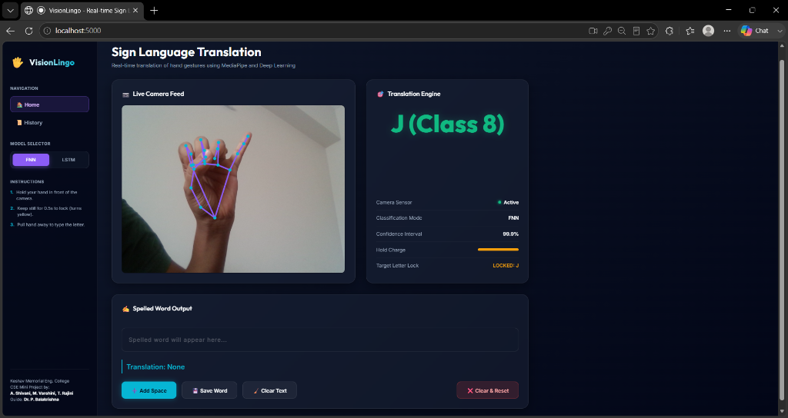
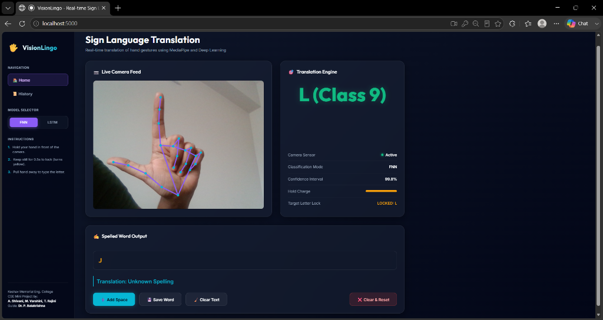
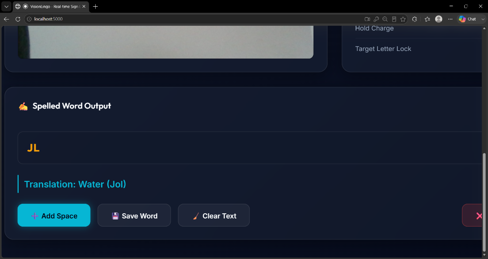

#  VisionLingo - Real-Time Sign Language Translation System

[](https://www.python.org/)
[](https://flask.palletsprojects.com/)
[](https://www.tensorflow.org/)
[](https://developers.google.com/mediapipe)
[](LICENSE)

**VisionLingo** is an end-to-end, lightweight, camera-based sign language recognition and translation web application. It bridges the communication barrier between the hearing-impaired community and the hearing population by translating static hand signs and dynamic motion sequences into text in real-time.

---

##  Key Features

*  Client-Side Landmark Extraction**: Uses Google's **MediaPipe Hands** in the browser to extract 21 3D joint landmarks (42 coordinate features) at 30+ FPS.
* Mathematical Normalization Pipeline**:
* Aspect-Ratio Center-Cropping**: Adjusts widescreen ($16:9$) camera feeds to a virtual $4:3$ grid to prevent coordinate distortion.
* Wrist Centering (Translation Invariance)**: Aligns coordinates relative to the wrist (landmark 0), allowing signing from anywhere in frame.
* Max Absolute Scaling (Scale Invariance)**: Standardizes coordinate sizes to $[-1.0, 1.0]$ regardless of hand distance from the camera.
* Mirror Correction**: Negates relative $X$ coordinates to match the webcam view with the training dataset.
* Dual Deep Learning Models:
  * FNN (Feedforward Neural Network)**: Classifies static single-frame hand poses with **95.00%** test accuracy.
  * LSTM (Long Short-Term Memory)**: Classifies dynamic temporal sequences across 15 consecutive frames with **96.00%** test accuracy.
* Word Builder & Dictionary Translation**: Accumulates spelled letters into words (e.g., `J` + `L` $\rightarrow$ `JL`) and translates them into meaningful phrases (e.g., `Water (Jol)`).
* Translation History**: Automatically logs translated words and timestamps into local browser storage.
* Secure Authentication**: Split-pane sign-in/sign-up interface for user session management.

---

##  Application Screenshots

| Dynamic Gesture Detection (`J`) | Static Gesture Detection (`L`) | Word Translation Output (`Water`) |
|:---:|:---:|:---:|
|  |  |  |
| **99.9% Confidence Recognition** | **Automatic Letter Lock** | **Dictionary Meaning: Water (Jol)** |

---

##  System Architecture

```text
 ┌─────────────────────────────────────────────────────────────┐
 │                       BROWSER CLIENT                        │
 │                                                             │
 │   [ Webcam Feed ]                                           │
 │          │                                                  │
 │          ▼                                                  │
 │   [ MediaPipe Hands Local Tracking (21 Landmarks) ]         │
 │          │                                                  │
 │          ▼                                                  │
 │   [ Aspect Ratio (4:3) Crop & Normalization Math ]          │
 │          │                                                  │
 │          ▼                                                  │
 │   [ Client API Connector (Axios POST) ] ◄───┐               │
 └──────────┬──────────────────────────────────┼───────────────┘
            │                                  │
            │ HTTP POST                        │ HTTP JSON
            │ (Landmarks JSON)                 │ Response
            ▼                                  │
 ┌──────────┼──────────────────────────────────┼───────────────┐
 │          ▼                                  │               │
 │   [ REST API Router (/predict) ]            │               │
 │          │                                  │               │
 │          ▼                                  │               │
 │   [ Trained Model Predictor ] ──────────────┼──► [ Assamese │
 │          │                                  │     Map       │
 │          │ (Runs Inference)                 │     Lookup ]  │
 │          ▼                                  │               │
 │  ┌───────┴──────────────────────────────┐   │               │
 │  │        DEEP LEARNING ENGINE          │   │               │
 │  │                                      │   │               │
 │  │  [ FNN Model ]      [ LSTM Model ]   │   │               │
 │  │  (Static Poses)    (Movements/Seq)   │   │               │
 │  │    (95% Acc)          (96% Acc)      │   │               │
 │  └──────────────────────────────────────┘   │               │
 │                                             │               │
 │             FLASK BACKEND SERVER            │               │
 └─────────────────────────────────────────────┴───────────────┘
```

---

##  Gesture Mapping Reference

| Class ID | Target Character | Hand Gesture Description |
|---|---|---|
| **Class 1** | **O** | OK Gesture shape |
| **Class 2** | **I** | Little/Pinky Finger Up |
| **Class 3** | **I** | Little/Pinky Finger Up (variant) |
| **Class 4** | **U** | Vertical Index and Middle fingers up |
| **Class 5** | **O** | O-shape circular hand configuration |
| **Class 6** | **K** | Open Palm gesture |
| **Class 7** | **E** | Thumb extended outward (Thumbs Up) |
| **Class 8** | **J** | Pinky tracing curve path (LSTM Dynamic) |
| **Class 9** | **L** | L-shape thumb and index finger |

###  Word Translation Samples:
* `EK` $\rightarrow$ **One (Ek)**
* `JL` / `JOL` $\rightarrow$ **Water (Jol)**
* `KL` / `KOL` $\rightarrow$ **Banana / Tap (Kol)**
* `OL` $\rightarrow$ **Few / Little (Ol)**
* `LOK` $\rightarrow$ **People (Lok)**
* `OI` $\rightarrow$ **Hey / Listen (Oi)**

---

##  Technology Stack

| Component | Technology | Version | Purpose |
|---|---|---|---|
| **Language** | Python | `3.10` | Backend data processing and machine learning pipelines |
| **Backend** | Flask | `2.2.2` | REST API routes, user auth, and model serving |
| **Server** | Gunicorn | `20.1.0` | Production WSGI HTTP Server for cloud deployment |
| **Machine Learning** | TensorFlow / Keras | `2.10.0` | FNN and LSTM model building, training, and inference |
| **Computer Vision** | MediaPipe | `0.10.0` | Client-side 3D hand keypoint extraction |
| **Array Math** | NumPy | `1.23.5` | Fast matrix coordinate normalization and transformations |
| **Data Cleaning** | Pandas | `1.5.3` | Dataset CSV loading and preprocessing |
| **ML Utilities** | Scikit-learn | `1.2.2` | Label encoding, train-test splitting, and class weight balancing |
| **Frontend** | HTML5 / Vanilla CSS | Standard | Responsive glassmorphic dashboard interface |
| **Client HTTP** | Axios | `1.x` | Asynchronous AJAX payload communication |

---

##  Getting Started Locally

### 1. Clone the Repository
```bash
git clone https://github.com/YOUR_USERNAME/VisionLingo.git
cd VisionLingo
```

### 2. Set Up Virtual Environment & Install Dependencies
```bash
# Create virtual environment
python -m venv venv

# Activate virtual environment
# On Windows:
venv\Scripts\activate
# On macOS/Linux:
source venv/bin/activate

# Install requirements
pip install -r requirements.txt
```

### 3. Run the Application
```bash
python app.py
```

### 4. Open in Browser
Navigate to `http://localhost:5000` in Google Chrome or Microsoft Edge.
1. Sign up or log in.
2. Grant camera permissions.
3. Hold hand gestures in front of the camera to translate in real-time!

---

##  Project Team & Credits

**Department of Computer Science & Engineering**  
**Keshav Memorial Engineering College (KMEC), Hyderabad**  
*(Affiliated to Osmania University)*

* **A. Shivani** (Roll No: `245523733005`)
* **M. Varshini** (Roll No: `245523733040`)
* **T. Rajini** (Roll No: `245523733055`)

**Project Guide**: **Dr. P. Balakrishna**, Professor, Department of CSE
